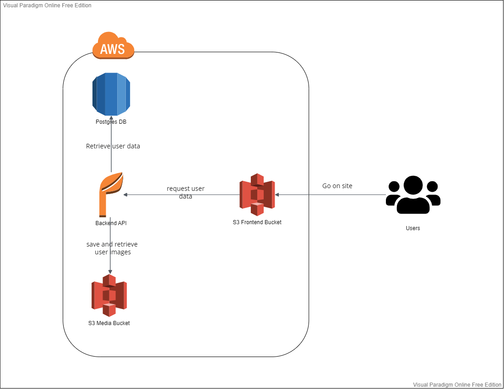

## Table of Contents
- [Infrastructure](#infrastructure)
- [Dependencies](#dependencies)
- [Pipeline Process](#pipeline-process)


### Infrastructure
```
- Using an AWS RDS for storing user info and image location
- Using an AWS S3 Bucket for hosting the frontend and images
- Using an AWS Elastic Beanstalk for hosting the node js backend 
```


### Dependencies

```
- Node v14.15.1 (LTS) or more recent. While older versions can work it is advisable to keep node to latest LTS version

- npm 6.14.8 (LTS) or more recent, Yarn can work but was not tested for this project

- AWS CLI v2, v1 can work but was not tested for this project

- A RDS database running Postgres.

- A S3 bucket for hosting uploaded pictures.
```

### Pipeline process
```
- CircleCi pipeline is triggered when pushing a new commit into the master branch
- CircleCi spin up a new docker container for running the jobs
- Install the required programs for the deployment [nodejs, aws cli, elastic beanstalk cli]
- Pull the new updates from github
- Installing the required modules 
- Build the frontend and the backend
- Upload the frontend static file into S3 bucket
- Deploy the backend into elastic beanstalk
```