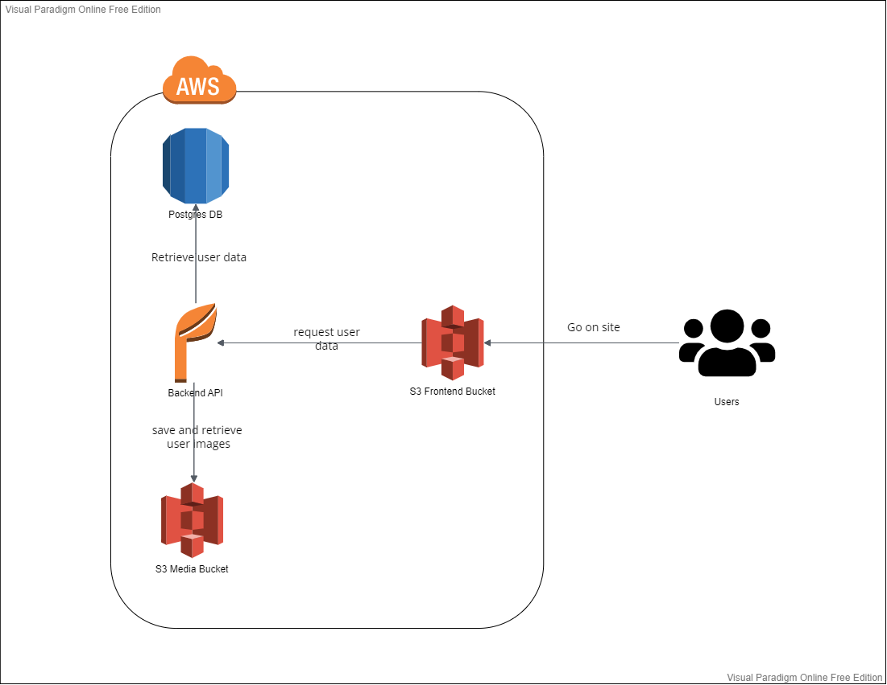

### Infrastructure
```
- Using an AWS RDS for storing user info and image location
- Using an AWS S3 Bucket for hosting the frontend and images
- Using an AWS Elastic Beanstalk for hosting the node js backend 
```
