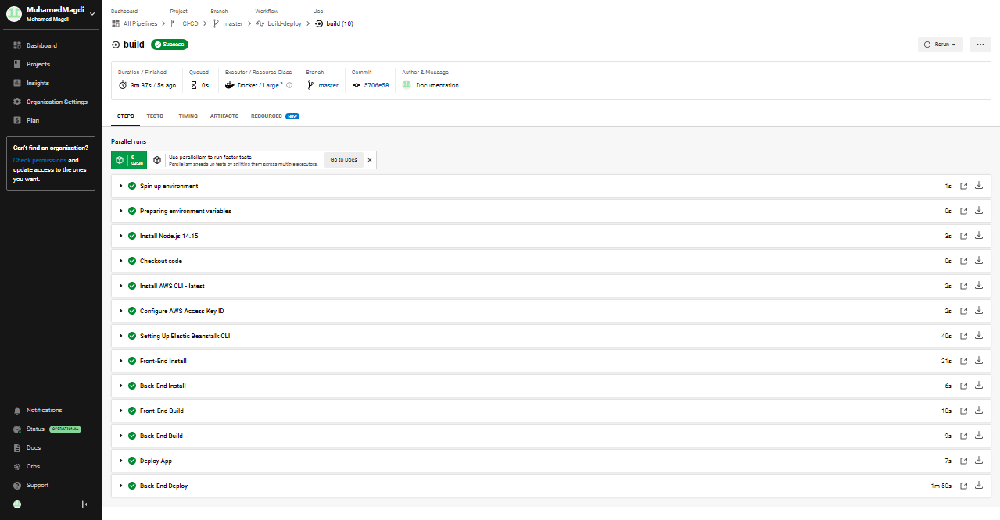

### Pipeline process
```
- CircleCi pipeline is triggered when pushing a new commit into the master branch
- CircleCi spin up a new docker container for running the jobs
- Install the required programs for the deployment [nodejs, aws cli, elastic beanstalk cli]
- Pull the new updates from github
- Installing the required modules 
- Build the frontend and the backend
- Upload the frontend static file into S3 bucket
- Deploy the backend into elastic beanstalk
```
s